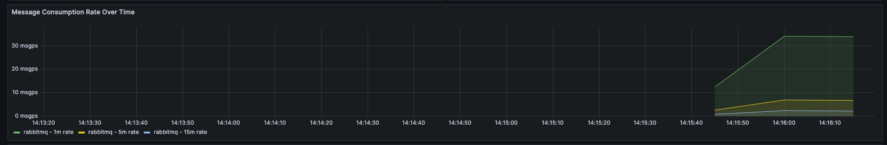
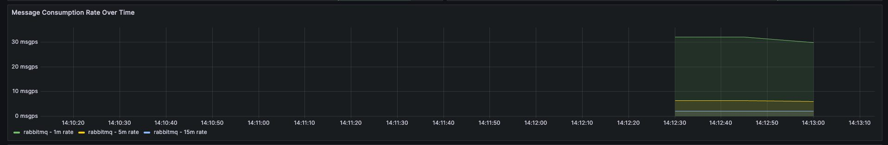
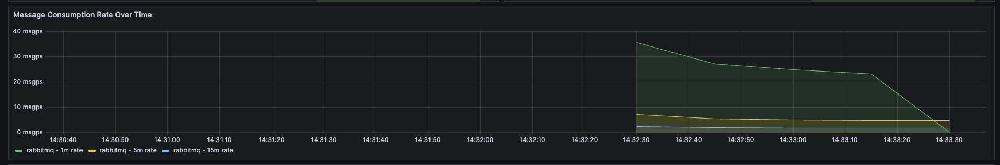
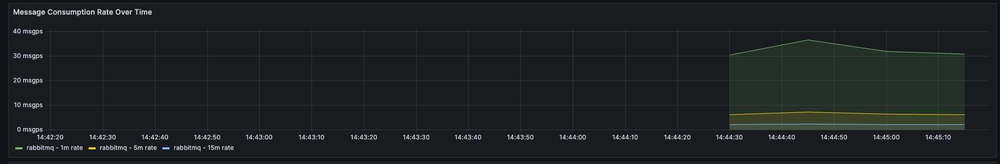
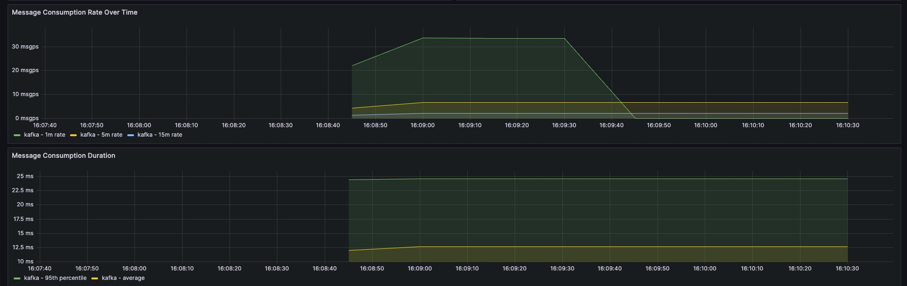
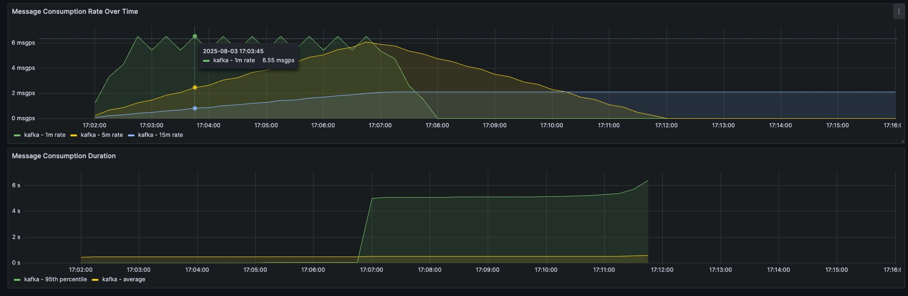
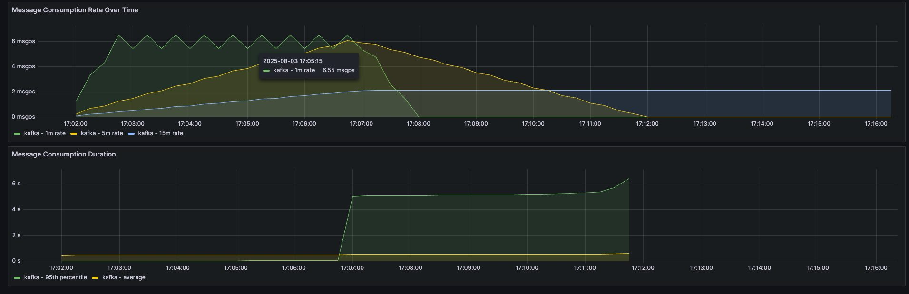

# RabbitMQ vs Kafka Consumer Performance Comparison

This README demonstrates the differences in message consumption patterns using RabbitMQ and Kafka under various configurations. For each scenario, a performance chart or picture is provided to visualize the results.

## RabbitMQ Consumption Scenarios

We compare two main RabbitMQ consumer modes:
- **Auto Acknowledge (auto ack)**
- **Manual Acknowledge (manual ack)**

For each mode, we vary the `prefetch` count (the maximum number of unacknowledged messages a consumer can receive):

### 1. Prefetch = 10

- **Auto Ack**
  - 
- **Manual Ack**
  - 

### 2. Prefetch = 30

- **Auto Ack**
  - 
- **Manual Ack**
  - 

---

## Kafka Consumption Scenarios

Kafka is tested with:
- **Default Consumer Settings**
  - 
- **Controlled Concurrency**
  - 
  - 

---

## Summary Table

| Scenario                                   | RabbitMQ Auto Ack | RabbitMQ Manual Ack | Kafka Default | Kafka Controlled Concurrency |
|---------------------------------------------|:-----------------:|:------------------:|:-------------:|:---------------------------:|
| Prefetch = 1                               |  |  |  |  |
| Prefetch = 10                              |  |  |   |   |
| Prefetch = 30                              |  |  
---
